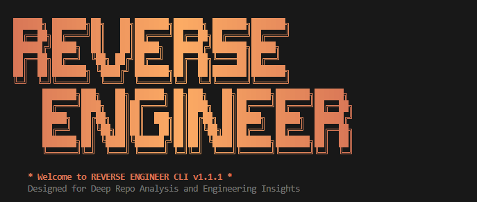
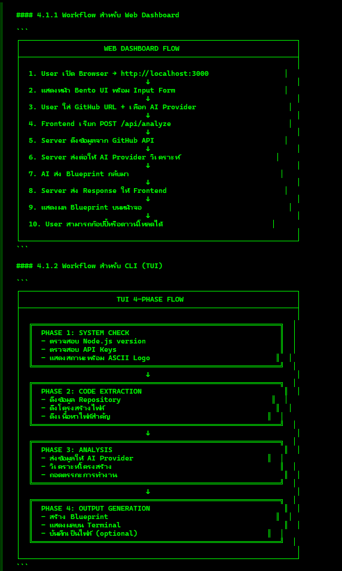

# REVERSE ENGINEER



> [!NOTE]
> [Thai Version here / ดูฉบับภาษาไทยที่นี่](README.md)

## Advanced Repository Analysis & Technical Blueprinting Hub

REVERSE ENGINEER is a sophisticated engineering tool designed for analyzing and decomposing complex GitHub repositories. It extracts high-fidelity context from the source and leverages advanced AI models to map architectural patterns, resolve complex logic, and generate comprehensive implementation specifications.

---

## Core Capabilities

### 1. High-Fidelity Dashboard

- **Bento UI Architecture**: A cohesive dashboard that integrates visual analysis and operation logs in one view.
- **Cinematic Workspace**: A premium environment designed for long-form technical research and code audit.
- **Structural Integrity**: Native Markdown rendering for AI outputs with precise syntax highlighting.
- **Blueprint Mode**: Sophisticated prompt generation specifically optimized for downstream AI development tasks.

### 2. Professional 4-Phase TUI

- **Systematic Workflow**: A dedicated 4-phase process covering Handshake, Extraction, Synthesis, and Delivery.
- **Engineering Aesthetics**: Sophisticated, terminal-native aesthetics influenced by Anthropic's Claude interface.

### 3. Blueprint Generation (The Architect System)

- Beyond standard code summaries, it generates a full **Technical Implementation Specification**.
- It provides a granular map of data structures, execution flows, and architectural boundaries, enabling other AI agents to recreate modules with high precision.

### 4. Unified Launcher System

- A single entry point for all operations. Run `npm start` to access either the Web Dashboard or the Terminal User Interface (TUI). Background server processes are handled automatically for seamless switching.

---

## Interface Showcase

| Web Dashboard | TUI Operation | Analysis Result |
| :---: | :---: | :---: |
|  |  |  |

---

## Technical Setup

### 1. Installation

```bash
npm install
```

### 2. Environment Configuration

Create a `.env` file and populate the necessary authentication keys:

```env
OPENAI_API_KEY=your_key_here
ANTHROPIC_API_KEY=your_key_here
KILOCODE_API_KEY=your_key_here
GITHUB_TOKEN=recommended_for_higher_limits
```

### 3. Execution

```bash
npm start
```

---

## Headless CLI Operations

Access direct terminal commands with the following syntax:

```bash
# Full repository analysis with blueprint output
npm run tui --url "[github-url]" --style blueprint --language Thai

# Focused file analysis using a specific AI provider
npm run tui --url "[github-file-url]" --provider anthropic --model claude-3-5-sonnet-latest
```

---

## Project Architecture

- `/cli`: Professional Terminal User Interface implementation.
- `/server`: High-performance API Gateway and GitHub mining engine.
- `/public`: Static source for the web dashboard.
- `index.js`: Unified launcher and system entry point.

---

© 2026 REVERSE ENGINEER | Engineered for Architects and Security Researchers.
